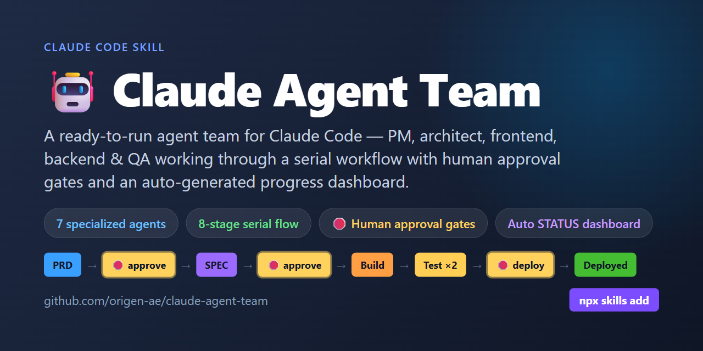
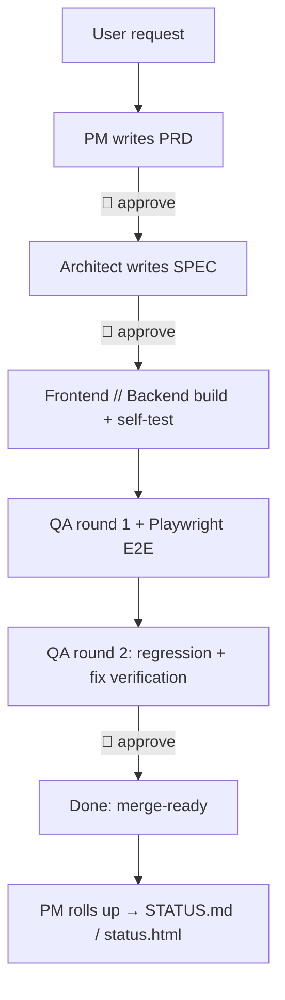
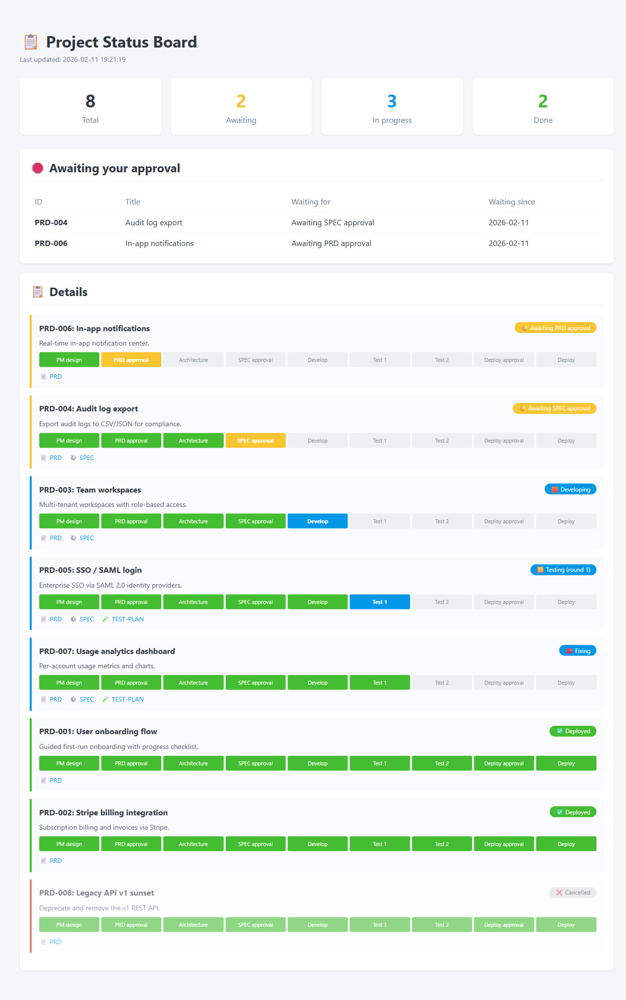
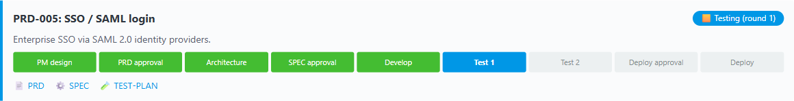

# 🤖 Claude Agent Team

> A ready-to-run agent team for Claude Code — PM, architect, frontend, backend & QA working through an 8-stage serial workflow with human approval gates, a shared document system (PRD/SPEC/TEST-PLAN/ADR/RUNBOOK/BACKLOG), and an auto-generated progress dashboard.

[](https://github.com/origen-ae/claude-agent-team/stargazers)
[](https://github.com/origen-ae/claude-agent-team/actions/workflows/validate.yml)
[](LICENSE)


**One assistant can write code. A *team* can ship it — with design, review, tests, and your sign-off at every gate.** ⭐ Star this if it's useful.

`7 agents` · `8 stages` · `3 human approval gates` · `7 doc types` · `0 external dependencies`

**Who it's for:** solo developers orchestrating AI coding, small teams that want a repeatable AI dev process, and anyone who needs an auditable trail from requirement to design to tests to ship.

**Contents:** [Why](#why) · [Quick start](#quick-start) · [What you get](#what-you-get) · [Dashboard](#the-dashboard) · [Worked example](#worked-example) · [How it's different](#how-its-different) · [Contributing](#contributing)

## What it is

Claude Agent Team scaffolds a complete, opinionated multi-agent development team into your project in one step. Instead of one assistant doing everything, you get seven focused agents that hand work off in a strict, reviewable order — and a dashboard that shows you exactly where every requirement stands.

## Why

Multi-agent coding usually breaks down in predictable ways:

- **Progress is a black box** — you can't tell what's done, in progress, or stuck.
- **Agents freelance** — they skip design, invent APIs, and step on each other.
- **No human checkpoints** — work barrels past the points where you'd want to approve.
- **Docs scatter** — requirements, design, and tests drift apart.

This skill fixes all four: a serial flow, mandatory approval gates, a centralized auto-generated dashboard, and an ID-paired document system.

## Quick start

**Via plugin marketplace:**
1. Add the marketplace: `/plugin marketplace add origen-ae/claude-plugins`
2. Install: `/plugin install claude-agent-team`
3. In your project, tell Claude Code: **"set up an agent team in this project."**

**Via git clone:**
1. Clone the skill into your skills directory:
   ```bash
   # Global — available in all projects:
   git clone https://github.com/origen-ae/claude-agent-team.git ~/.claude/skills/claude-agent-team

   # Or project-local:
   git clone https://github.com/origen-ae/claude-agent-team.git .claude/skills/claude-agent-team
   ```
2. In your project, tell Claude Code: **"set up an agent team in this project."**

Then: approve the scaffold, install dependencies, and run your first requirement through the 8 stages.

> **Installing into a project that already has `.claude/settings.json`?** The scaffold is merged key-by-key, not overwritten: set `env.CLAUDE_CODE_EXPERIMENTAL_AGENT_TEAMS=1`, union the existing `permissions.deny` list, and append the PostToolUse hook.
> A `.bak` backup of your `settings.json` (and `CLAUDE.md`) is taken first.

## What you get

| Agent | Responsibility | Key output |
|---|---|---|
| pm | Requirements + progress roll-up | PRD + STATUS |
| architect | Tech design, decisions | SPEC, ADR |
| frontend | UI implementation | code + component tests |
| backend | API/business logic | code + unit tests |
| qa | Test design & execution (2 rounds) | TEST-PLAN, E2E |
| reviewer | Code review (subagent) | review report |
| librarian | Doc retrieval (subagent) | search results |



## The dashboard

Every agent only updates a `stage` field in each doc's frontmatter; `scripts/build_status.py` aggregates them by requirement ID and regenerates `STATUS.md` and `status.html`. A PostToolUse hook runs a cross-platform Python entry (`scripts/refresh_status.py`) on every `docs/*.md` edit — working identically on Windows, macOS, and Linux — so the board is never stale.



Each requirement shows a live progress bar across all milestones — done, current, and pending:



## What a session looks like

> **You:** "Add points-based checkout discounts."

1. **PM** drafts `PRD-008` — features, prototype, business flow, data flow → 🛑 **waits for your approval**.
2. You approve. **Architect** writes `SPEC-008` — API, data model, task breakdown → 🛑 **waits for your approval**.
3. You approve. **Frontend** and **Backend** build in parallel, each spawning **reviewer** when done.
4. **QA** writes `TEST-PLAN-008` + Playwright E2E and runs round 1; failures bounce back to dev as `fixing`.
5. **QA** reruns regression (round 2) → 🛑 **waits for your ship approval**.
6. You approve → **Done (approved & merge-ready)**. Every stage change refreshes the dashboard automatically.

At each 🛑 the team stops and waits — you stay in control, and the board always shows who's doing what.

## Worked example

Want to see the actual output? [`examples/loyalty-points-checkout/`](examples/loyalty-points-checkout/) holds the real, filled-in documents the team produced for one shipped feature — not templates:

[PRD-001](examples/loyalty-points-checkout/docs/prd/PRD-001.md) → [SPEC-001](examples/loyalty-points-checkout/docs/spec/SPEC-001.md) → [TEST-PLAN-001](examples/loyalty-points-checkout/docs/test-plan/TEST-PLAN-001.md)

The same ID threads through all three, and the test plan even records a real round-1 failure (a cents-rounding bug) and its verified round-2 fix.

## How it's different

|  | Single Claude | Ad-hoc subagents | **Claude Agent Team** |
|---|:---:|:---:|:---:|
| Specialized roles | ❌ | ⚠️ improvised | ✅ 7 defined agents |
| Serial orchestration & handoffs | ❌ | ❌ | ✅ 8-stage flow |
| Human approval gates | ❌ | ❌ | ✅ PRD · SPEC · ship |
| Centralized progress board | ❌ | ❌ | ✅ auto-generated |
| ID-paired docs (PRD→SPEC→tests) | ❌ | ❌ | ✅ |
| Right-sized flow (S/M/L tiers) | ❌ | ❌ | ✅ small changes skip the ceremony |
| Built-in E2E test layer | ❌ | ⚠️ | ✅ Playwright |

## Bundled skills

After scaffolding, two additional skills land in your project's `.claude/skills/` and are immediately usable:

| Skill | Trigger | Purpose |
|---|---|---|
| `/doc-conventions` | any agent creating or editing a doc | Frontmatter format, ID pairing rules, stage enum, modification rules |
| `/playwright-testing` | QA writing or running E2E tests | File layout, JSDoc header, locator priority, run commands |

These are project-local — they don't require a separate install and are automatically picked up by Claude Code.

## Browse the agents

You don't have to install anything to read the design:

- [Agents](assets/.claude/agents/) · [Bundled skills](assets/.claude/skills/) · [Doc templates](assets/docs/_templates/)
- Full design: [workflow](references/workflow.md) · [roles](references/roles.md) · [document system](references/document-system.md) · [scenarios](references/scenarios.md) · [FAQ](references/faq.md)

## Requirements

Claude Code (agent teams) and Python 3 (for the dashboard scripts and the PostToolUse hook — the hook is pure Python and runs on Windows, macOS, and Linux alike, with no POSIX shell, Git Bash, or WSL needed). Optionally Node + Playwright for the E2E layer.

The team delivers approved, tested, merge-ready code. Running CI/CD and the actual production deploy stay your responsibility — migration/rollback scripts and the RUNBOOK are produced for you, but no stage executes them.

## Upgrading

**Via plugin marketplace:** `/plugin update claude-agent-team`

**Via git clone:**
```bash
cd ~/.claude/skills/claude-agent-team && git pull   # adjust path if project-local
```

The skill trigger and scaffolding logic update immediately. **Already-scaffolded projects** won't auto-update — agent definitions and templates were copied into your project at install time. The installed version is stamped into your project as an HTML comment marker (`<!-- claude-agent-team: vX.Y.Z -->`) at the top of the project's `CLAUDE.md`, so you can always tell what you're running. To pick up changes from a new version, do a selective diff/merge of `assets/` against your `.claude/` directory — your own `docs/` are never touched. See [CHANGELOG](CHANGELOG.md) for what changed between versions.

## Uninstall

The scaffold owns a known set of paths: `.claude/agents/*`, `.claude/skills/doc-conventions`, `.claude/skills/playwright-testing`, `scripts/*.py`, `docs/_templates/`, `playwright.config.ts`, plus the agent-team block it appends to `.claude/settings.json` and `CLAUDE.md`. To remove it cleanly: restore `.claude/settings.json` and `CLAUDE.md` from the `.bak` backups taken at install, then delete the skill-owned paths above. Your own `docs/` requirements are yours to keep. Tip: install on a clean git tree or a dedicated branch so a `git checkout` is a reliable one-command rollback.

## Working as a team

Sharing the scaffold across a team has its own protocol — commit `.claude/` as shared truth (don't have everyone install separately), claim doc IDs with `scripts/next_id.py` on the integration branch before branching, and so on. See the **"Multi-Developer Mode"** section in your project's `CLAUDE.md` for the full workflow.

Add this to the **target project's** `.gitignore`:

```gitignore
# claude-agent-team generated artifacts
status.html
docs/index.yaml
playwright-report.json
__pycache__/
```

Only the integration branch commits `STATUS.md`.

## Contributing

Issues and PRs welcome — see [CONTRIBUTING.md](CONTRIBUTING.md). **If this saves you time, please ⭐ star the repo — it genuinely helps others find it.**

> Topics: `claude-code` `claude` `ai-agents` `multi-agent` `agentic-workflow` `claude-code-skill`

## Star history

[](https://star-history.com/#origen-ae/claude-agent-team&Date)

## License

MIT — see [LICENSE](LICENSE).
