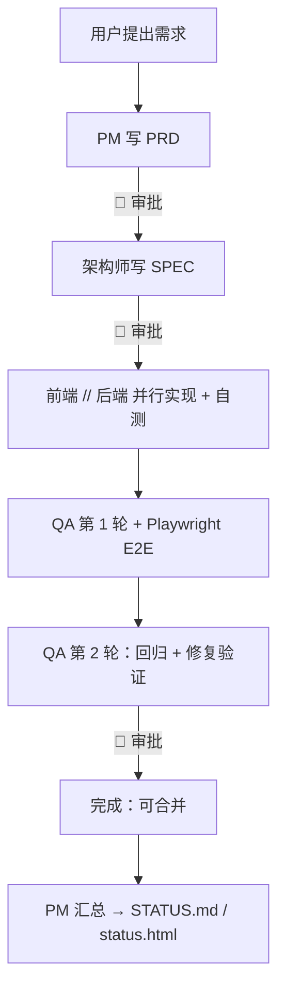

# 🤖 Claude Agent Team

[English](README.md) · **简体中文**

> 一套开箱即用的 Claude Code Agent 团队 —— 产品、架构、前端、后端、QA 沿着 8 阶段串行工作流协作，配有人工审批闸门、共享文档系统（PRD/SPEC/TEST-PLAN/ADR/RUNBOOK/BACKLOG），以及自动生成的进度看板。

[](https://github.com/origen-ae/claude-agent-team/stargazers)
[](https://github.com/origen-ae/claude-agent-team/actions/workflows/validate.yml)
[](LICENSE)


**一个助手能写代码。一个*团队*才能把它交付出去 —— 在每道闸门都有设计、评审、测试，和你的签字确认。** 如果有用，欢迎 ⭐ Star。

`7 个 agent` · `8 个阶段` · `3 道人工审批闸门` · `7 类文档` · `0 外部依赖`

**适合谁：** 编排 AI 编码的独立开发者、想要可复用 AI 开发流程的小团队，以及任何需要从需求→设计→测试→交付全程可审计追溯的人。

**目录：** [为什么](#为什么) · [快速开始](#快速开始) · [你会得到什么](#你会得到什么) · [进度看板](#进度看板) · [实战示例](#实战示例) · [与其他方式的区别](#与其他方式的区别) · [参与贡献](#参与贡献)

## 它是什么

Claude Agent Team 一步把一支完整、有主见的多 agent 开发团队脚手架装进你的项目。不再是一个助手包揽一切，而是七个各司其职的 agent 以严格、可评审的顺序交接工作 —— 还有一个看板，让你随时看清每个需求的确切进展。

## 为什么

多 agent 编码通常以可预测的方式崩坏：

- **进度是黑盒** —— 你说不清什么做完了、在进行、还是卡住了。
- **agent 各自为政** —— 跳过设计、自创 API、互相踩脚。
- **没有人工检查点** —— 工作一路冲过你本想审批的节点。
- **文档四散** —— 需求、设计、测试逐渐脱节。

这个 skill 把四点一并解决：串行流程、强制审批闸门、集中式自动生成看板，以及 ID 配对的文档系统。

## 快速开始

**通过插件市场（plugin marketplace）：**
1. 添加市场：`/plugin marketplace add origen-ae/claude-plugins`
2. 安装：`/plugin install claude-agent-team`
3. 在你的项目里告诉 Claude Code：**"set up an agent team in this project."**

**通过 git clone：**
1. 把 skill 克隆到你的 skills 目录：
   ```bash
   # 全局 —— 所有项目可用：
   git clone https://github.com/origen-ae/claude-agent-team.git ~/.claude/skills/claude-agent-team

   # 或仅当前项目：
   git clone https://github.com/origen-ae/claude-agent-team.git .claude/skills/claude-agent-team
   ```
2. 在你的项目里告诉 Claude Code：**"set up an agent team in this project."**

随后：确认脚手架、安装依赖，让你的第一个需求跑完 8 个阶段。

> **装进一个已经有 `.claude/settings.json` 的项目？** 脚手架会**按 key 合并**而不是覆盖：设置 `env.CLAUDE_CODE_EXPERIMENTAL_AGENT_TEAMS=1`、对已有的 `permissions.deny` 取并集、并把 PostToolUse 钩子追加进去。
> 合并前会先给你的 `settings.json`（以及 `CLAUDE.md`）生成 `.bak` 备份。

## 你会得到什么

| Agent | 职责 | 关键产物 |
|---|---|---|
| pm（产品） | 需求设计 + 进度汇总 | PRD + STATUS |
| architect（架构） | 技术设计、决策 | SPEC、ADR |
| frontend（前端） | UI 实现 | 代码 + 组件测试 |
| backend（后端） | API / 业务逻辑 | 代码 + 单元测试 |
| qa（测试） | 测试设计与执行（两轮） | TEST-PLAN、E2E |
| reviewer（评审） | 代码评审（子 agent） | 评审报告 |
| librarian（馆员） | 文档检索（子 agent） | 检索结果 |



## 进度看板

每个 agent 只更新各文档 frontmatter 里的 `stage` 字段；`scripts/build_status.py` 按需求 ID 聚合并重新生成 `STATUS.md` 和 `status.html`。一个 PostToolUse 钩子会在每次 `docs/*.md` 编辑时运行跨平台的 Python 入口（`scripts/refresh_status.py`）—— 在 Windows、macOS、Linux 上表现一致 —— 所以看板永不过期。


每个需求都显示一条贯穿所有里程碑的实时进度条 —— 已完成、进行中、待开始：


## 一次会话长什么样

> **你：** "加一个积分抵扣结账的功能。"

1. **PM** 起草 `PRD-008` —— 功能、原型、业务流、数据流 → 🛑 **等你审批**。
2. 你批准。**架构师** 写 `SPEC-008` —— API、数据模型、任务拆分 → 🛑 **等你审批**。
3. 你批准。**前端**和**后端**并行实现，各自在完成时拉起 **reviewer**。
4. **QA** 写 `TEST-PLAN-008` + Playwright E2E 并跑第 1 轮；失败的弹回 dev 进入 `fixing`。
5. **QA** 重跑回归（第 2 轮）→ 🛑 **等你交付审批**。
6. 你批准 → **完成（已批准、可合并）**。每次阶段变更都会自动刷新看板。

每个 🛑 处团队都会停下等待 —— 控制权在你手里，看板始终显示谁在做什么。

## 实战示例

想看真实产物？[`examples/loyalty-points-checkout/`](examples/loyalty-points-checkout/) 收录了团队为一个已交付功能产出的真实、填好的文档 —— 不是模板：

[PRD-001](examples/loyalty-points-checkout/docs/prd/PRD-001.md) → [SPEC-001](examples/loyalty-points-checkout/docs/spec/SPEC-001.md) → [TEST-PLAN-001](examples/loyalty-points-checkout/docs/test-plan/TEST-PLAN-001.md)

同一个 ID 贯穿三份文档，测试计划里甚至记录了一个真实的第 1 轮失败（一处分位舍入 bug）以及它在第 2 轮验证通过的修复。

## 与其他方式的区别

|  | 单个 Claude | 临时拼凑的子 agent | **Claude Agent Team** |
|---|:---:|:---:|:---:|
| 专职角色 | ❌ | ⚠️ 临时拼凑 | ✅ 7 个定义好的 agent |
| 串行编排与交接 | ❌ | ❌ | ✅ 8 阶段流程 |
| 人工审批闸门 | ❌ | ❌ | ✅ PRD · SPEC · 交付 |
| 集中式进度看板 | ❌ | ❌ | ✅ 自动生成 |
| ID 配对文档（PRD→SPEC→测试） | ❌ | ❌ | ✅ |
| 按变更大小分级（S/M/L） | ❌ | ❌ | ✅ 小改动跳过繁文缛节 |
| 内建 E2E 测试层 | ❌ | ⚠️ | ✅ Playwright |

## 随附的 skill

脚手架装好后，会有两个额外的 skill 落到你项目的 `.claude/skills/`，开箱即用：

| Skill | 触发时机 | 用途 |
|---|---|---|
| `/doc-conventions` | 任何 agent 创建或编辑文档时 | frontmatter 格式、ID 配对规则、stage 枚举、修改规则 |
| `/playwright-testing` | QA 编写或运行 E2E 测试时 | 文件布局、JSDoc 头、定位器优先级、运行命令 |

它们是项目本地的 —— 无需单独安装，Claude Code 会自动识别。

## 浏览这些 agent

不用安装任何东西就能阅读这套设计：

- [Agents](assets/.claude/agents/) · [随附 skill](assets/.claude/skills/) · [文档模板](assets/docs/_templates/)
- 完整设计：[工作流](references/workflow.md) · [角色](references/roles.md) · [文档系统](references/document-system.md) · [场景](references/scenarios.md) · [FAQ](references/faq.md)

## 环境要求

Claude Code（启用 agent teams）与 Python 3（用于看板脚本和 PostToolUse 钩子 —— 钩子是纯 Python，在 Windows、macOS、Linux 上一致运行，无需 POSIX shell、Git Bash 或 WSL）。E2E 层可选，需要 Node + Playwright。

团队交付的是**已批准、已测试、可合并**的代码。运行 CI/CD 和真正的生产部署仍由你负责 —— 迁移/回滚脚本和 RUNBOOK 会为你产出，但没有任何阶段会去执行它们。

## 升级

**通过插件市场：** `/plugin update claude-agent-team`

**通过 git clone：**
```bash
cd ~/.claude/skills/claude-agent-team && git pull   # 项目本地安装时请调整路径
```

skill 触发逻辑与脚手架逻辑会立即更新。**已经脚手架过的项目**不会自动更新 —— agent 定义和模板是在安装时拷贝进你项目的。已安装的版本会以 HTML 注释标记（`<!-- claude-agent-team: vX.Y.Z -->`）戳在项目 `CLAUDE.md` 顶部，所以你随时能知道自己在用哪个版本。要获取新版本的改动，把 `assets/` 与你的 `.claude/` 目录做一次有选择的 diff/合并 —— 你自己的 `docs/` 绝不会被动。版本间改动见 [CHANGELOG](CHANGELOG.md)。

## 卸载

脚手架拥有一组已知路径：`.claude/agents/*`、`.claude/skills/doc-conventions`、`.claude/skills/playwright-testing`、`scripts/*.py`、`docs/_templates/`、`playwright.config.ts`，外加它追加到 `.claude/settings.json` 和 `CLAUDE.md` 里的 agent-team 区块。要干净移除：从安装时生成的 `.bak` 备份恢复 `.claude/settings.json` 和 `CLAUDE.md`，再删掉上面这些 skill 拥有的路径。你自己的 `docs/` 需求文档归你保留。小贴士：在干净的 git 工作树或专用分支上安装，这样一条 `git checkout` 就是可靠的一键回滚。

## 团队协作

多人共享这套脚手架有自己的协议 —— 把 `.claude/` 作为共享真相提交（别让每个人各装一份）、分支前先用 `scripts/next_id.py` 在集成分支上占用文档 ID，等等。完整流程见你项目 `CLAUDE.md` 里的 **"Multi-Developer Mode"** 一节。

把这些加进**目标项目的** `.gitignore`：

```gitignore
# claude-agent-team 生成的产物
status.html
docs/index.yaml
playwright-report.json
__pycache__/
```

只有集成分支提交 `STATUS.md`。

## 安全

安全在团队真正能控制的层面落实：

- **设计期** —— 任何触及鉴权、金额/余额、PII、文件上传或不可信输入的功能，架构师的 SPEC 都会包含一节 **"Security & abuse cases"**（一次轻量 STRIDE：每个威胁 → 缓解 → 验证它的测试）。这驱动 qa 的负向测试和 reviewer 的审查重点。
- **评审期** —— reviewer 对敏感 diff 做**安全深查**（每个写操作的鉴权 / 无 IDOR、注入、密钥与 PII、金额/状态完整性、新依赖）。

**仍归你的（CI）：** 与交付边界一致，依赖/供应链扫描和 SAST 跑在*你的* CI 里，而非 agent 团队。建议：

```yaml
# 在你自己的 CI、PR 上
- run: npm audit --audit-level=high      # 或：pip-audit
# 可选的静态分析：
# - uses: github/codeql-action/analyze   # 或 semgrep
```

也建议启用 **Dependabot** 或 **Renovate**，让新增/传递依赖获得 CVE 告警。我们有意不内置专职安全 agent —— 对小团队太重；上面的设计期 + 评审期覆盖才是高价值、在范围内的部分。

## 参与贡献

欢迎提 Issue 和 PR —— 见 [CONTRIBUTING.md](CONTRIBUTING.md)。**如果它帮你省了时间，请 ⭐ Star 仓库 —— 这能切实帮助别人发现它。**

> 主题标签：`claude-code` `claude` `ai-agents` `multi-agent` `agentic-workflow` `claude-code-skill`

## Star 历史

[](https://star-history.com/#origen-ae/claude-agent-team&Date)

## 许可证

MIT —— 见 [LICENSE](LICENSE)。
