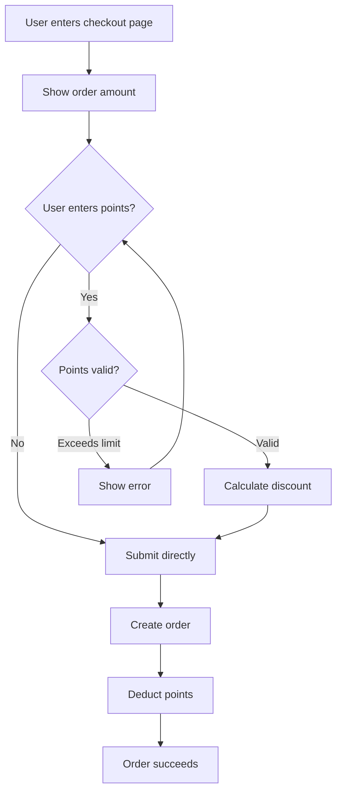
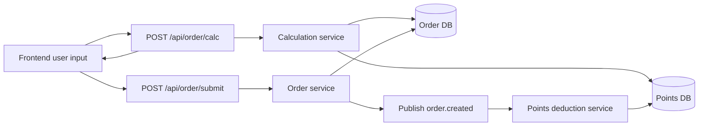

# Title

## TL;DR

<!-- 1-3 sentences: What is this feature? Who is it for? What core problem does it solve? -->

## 1. Background and Goals

### 1.1 Background

<!-- Current state, user pain points, why now. No more than one paragraph. -->

### 1.2 Business Goals

- 

### 1.3 User Goals

- 

### 1.4 Success Metrics

<!-- Measurable, e.g. "next-day retention up 5%", "support tickets down 20%" -->

- 

## 2. User Stories

### Story 1: <one-line description>

As a <user role>, I want to <do something>, so that <value>.

**Acceptance Criteria** (each must be testable):

- [ ] AC1: When <condition>, <what should happen>
- [ ] AC2: When <error condition>, <what should happen>

### Story 2: ...

## 3. Feature List

| ID | Feature | Priority | Description | Related Story |
|---|---|---|---|---|
| F1 | | P0 | | Story 1 |
| F2 | | P1 | | Story 2 |
| F3 | | P2 | | |

## 4. Prototype Design

<!-- For simple cases use an ASCII wireframe; for complex ones link to Figma -->

### 4.1 Main Interface

```
┌─────────────────────────────┐
│  Header                      │
├─────────────────────────────┤
│  [Enter points: ___]  [Apply] │  ← E2E key point
│                              │
│  Order amount: ¥100          │
│  Points discount: -¥1        │
│  Amount due: ¥99             │
├─────────────────────────────┤
│        [Submit Order]        │  ← E2E key point
└─────────────────────────────┘
```

Or: [Figma link](https://figma.com/...)

### 4.2 E2E Test Key Points

Mark which elements must be covered by Playwright E2E (frontend must add a data-testid for these elements):

| Element | Purpose | Suggested data-testid |
|---|---|---|
| Points input | User enters number of points | `checkout-input-points` |
| Apply button | Triggers points calculation | `checkout-btn-apply-points` |
| Submit order button | Completes the order | `checkout-btn-submit` |
| Error message | Shown when points exceed the limit | `checkout-points-error` |

### 4.3 State Changes

- **Loading**: Show a spinner while calculating points
- **Empty**: Show "No points available" when the user has no points
- **Error**: Show the specific reason when points exceed the limit
- **Success**: Show the amount change when the discount is applied successfully

## 5. Business Flow



### Error Branches

| Error | Trigger Node | Handling |
|---|---|---|
| Points exceed balance | Validate points | Show the specific available points |
| Discount exceeds 50% of order | Validate points | Show the maximum discount cap |
| Payment failure | Create order | Refund the frozen points |

## 6. Data Flow



### Data Involved

- User points balance (points service)
- Order amount (order service)
- Discount ratio rules (config)
- Points change ledger (points service)

## 7. Non-Goals

Explicitly out of scope. Each deferred item **must** have a matching entry in `docs/backlog.md` and be referenced by its `BACKLOG-NNN` id:

- No points gifting (existing functionality unchanged) — see [BACKLOG-001](../backlog.md)
- No points expiration (revisit in v2) — see [BACKLOG-002](../backlog.md)
- No stacking of points + coupons (v1 is points only) — see [BACKLOG-003](../backlog.md)

## 8. Risks and Dependencies

| Risk/Dependency | Type | Impact | Mitigation |
|---|---|---|---|
| High points-service latency | Technical | Slower checkout | Add caching |
| Points calculation precision | Technical | Financial issues | Store cents as integers |

## 9. Related Documents

- Technical spec: (to be backfilled as SPEC-008 once architect creates it)
- Test plan: (to be backfilled as TEST-PLAN-008 once qa creates it)
