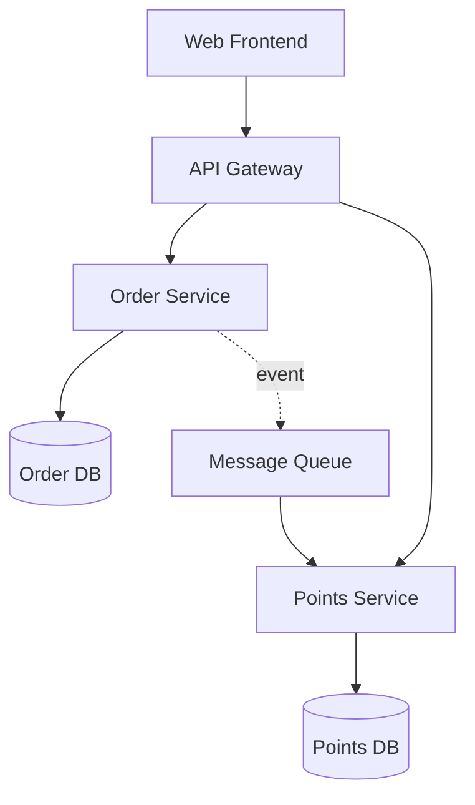
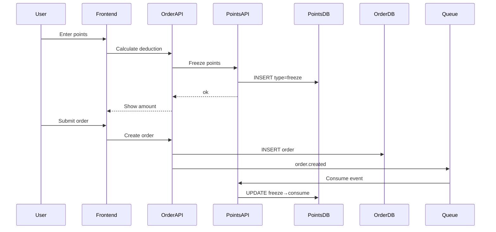

# <Feature Name> Technical Spec

## TL;DR

<!-- 1-3 sentences: core of the technical approach, key decisions, estimated effort -->

## 1. Links

- **PRD**: PRD-XXX
- **Related ADRs**: (if any)
- **Related existing SPECs**: (if any)

## 2. Technical Approach Overview

<!-- One paragraph: what technology is used and how it integrates with the existing system -->

## 3. Architecture Diagram



## 4. Module / Component Breakdown

| Component | Responsibility | Type | Owner agent |
|---|---|---|---|
| PointsCalcAPI | Calculate deductible points | New | backend |
| OrderSubmitAPI | Create order with points | Modify | backend |
| PointsDeductService | Deduct points | New | backend |
| CheckoutPointsInput | Points input component | New | frontend |
| CheckoutSummary | Display settlement amount | Modify | frontend |

## 5. API Design

### 5.1 POST /api/order/calc

**Purpose**: Calculate the order amount after applying points

**Request**:

```json
{
  "order_id": "ord_123",
  "points": 100
}
```

**Response (success)**:

```json
{
  "code": "ok",
  "data": {
    "order_amount": 100.00,
    "points_applied": 100,
    "discount": 1.00,
    "final_amount": 99.00,
    "max_deductible_points": 5000
  }
}
```

**Response (error)**:

| Error Code | HTTP | Meaning | Trigger Condition |
|---|---|---|---|
| POINTS_INSUFFICIENT | 400 | Not enough points | User balance < input |
| POINTS_OVER_LIMIT | 400 | Exceeds deduction cap | Deduction > 50% of order |
| ORDER_NOT_FOUND | 404 | Order does not exist | Invalid order_id |

### 5.2 POST /api/order/submit

(Similar format...)

## 6. Data Model

### Table: points_account (existing)

No changes.

### Table: points_transaction (new)

| Field | Type | Required | Constraints | Notes |
|---|---|---|---|---|
| id | bigint | ✅ | PK, auto_increment | |
| user_id | bigint | ✅ | FK | |
| order_id | varchar(50) | ✅ | | Associated order |
| amount | int | ✅ | | Change in cents (note: unit is cents, not dollars) |
| balance | int | ✅ | | Balance after the change |
| type | enum | ✅ | | freeze/consume/refund |
| created_at | timestamp | ✅ | default NOW | |

Indexes:
- `idx_user_created` (user_id, created_at)
- `idx_order` (order_id)

## 7. Technical Implementation of the Business Flow

### 7.1 Points Freeze-Deduct Flow (two-phase)



### 7.2 Exception Handling

- Freeze succeeds but order creation fails → auto-unfreeze after 5 minutes (cron)
- Order created but event lost → hourly reconciliation script compensates

## 8. Implementation Task Breakdown

| TaskID | Description | Owner | Depends On | Estimate |
|---|---|---|---|---|
| T1 | DB migration: create points_transaction table | backend | - | 0.5 d |
| T2 | Implement PointsCalcAPI | backend | T1 | 1 d |
| T3 | Implement PointsDeductService | backend | T1 | 1 d |
| T4 | Modify OrderSubmitAPI | backend | T2, T3 | 0.5 d |
| T5 | CheckoutPointsInput component | frontend | - | 0.5 d |
| T6 | Modify CheckoutSummary | frontend | - | 0.5 d |
| T7 | Frontend integration with PointsCalcAPI | frontend | T2 | 0.5 d |
| T8 | Frontend integration with OrderSubmitAPI | frontend | T4 | 0.5 d |

Parallelization opportunities: backend does T1-T4, frontend does T5-T6 (in parallel), with T7-T8 as the integration phase.

## 9. Performance / Availability Targets

- PointsCalcAPI P95: < 200ms
- OrderSubmitAPI P95: < 500ms
- Availability: 99.9%
- Data consistency: eventual consistency (within 5 minutes)

## 10. Risks and Mitigations

| Risk | Probability | Impact | Mitigation |
|---|---|---|---|
| Points calculation precision issues | Medium | Finances don't reconcile | Store cents as integers, unit tests cover boundaries |
| Duplicate deduction under high concurrency | Medium | User over-charged | Database row lock + idempotency key |
| Points rollback on refund | Low | User under-credited | Refund API auto-triggers rollback |
