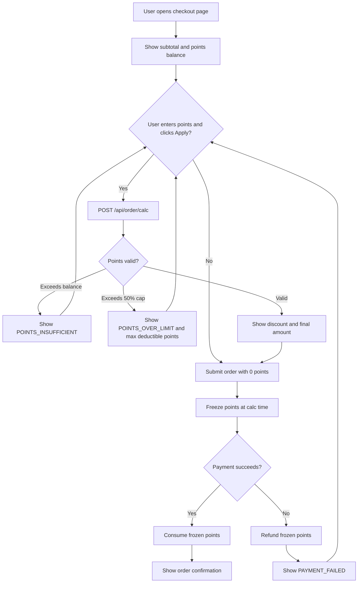
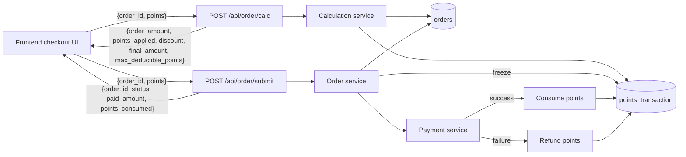

# Loyalty points checkout discount

## TL;DR

Lets shoppers redeem their loyalty points for an instant discount at checkout. The conversion is fixed at 100 points = $1.00, the discount is capped at 50% of the order subtotal, and points are frozen at calculation time and only consumed when the order is paid (refunded if payment fails). This turns an idle points balance into a concrete reason to complete the purchase.

## 1. Background and Goals

### 1.1 Background

We have run a loyalty program for over a year and members have accumulated a large, growing points balance, but the only way to spend points today is a clunky "redeem for a coupon code" flow that most users never discover. Members repeatedly ask in support tickets how to "use my points," and abandoned-cart surveys cite price as the top reason for drop-off. Letting points be applied directly at checkout closes both gaps at once and gives members a visible, immediate payoff for staying loyal.

### 1.2 Business Goals

- Increase checkout conversion rate for logged-in members with a points balance.
- Increase loyalty program engagement by giving points a clear, frictionless redemption path.
- Reduce points-redemption support tickets by removing the coupon-code workaround.

### 1.3 User Goals

- See, in one place at checkout, how many points I have and how much money they are worth.
- Apply points and immediately see the updated amount I owe before I commit to paying.
- Trust that if my payment fails, my points are returned to me automatically.

### 1.4 Success Metrics

- Member checkout conversion rate up at least 3 percentage points within 60 days of launch.
- At least 25% of eligible orders (logged-in member with a non-zero balance) apply points within 60 days.
- Points-redemption support tickets down at least 40% within 60 days.
- Zero financial discrepancies in points-vs-money reconciliation (points consumed must equal discount granted, to the cent).

## 2. User Stories

### Story 1: Redeem points for a discount at checkout

As a logged-in member with a points balance, I want to enter how many points to redeem and see the discount applied to my order, so that I pay less and get visible value from my loyalty.

**Acceptance Criteria** (each must be testable):

- [ ] AC1: When I redeem 100 points on an order, the order total is reduced by exactly $1.00 (100 points = $1.00).
- [ ] AC2: When I try to redeem more points than my available balance, the system rejects it and returns `POINTS_INSUFFICIENT`.

### Story 2: Stay protected by the discount cap and payment safety net

As a member redeeming points, I want the system to enforce a fair cap and protect my points on payment problems, so that I cannot over-redeem and never lose points to a failed transaction.

**Acceptance Criteria** (each must be testable):

- [ ] AC3: When the requested discount would exceed 50% of the order subtotal, the system rejects it and returns `POINTS_OVER_LIMIT`; the discount is capped at 50% of subtotal.
- [ ] AC4: When payment fails after points were frozen, the frozen points are refunded back to my balance.

## 3. Feature List

| ID | Feature | Priority | Description | Related Story |
|---|---|---|---|---|
| F1 | Points calculation at checkout | P1 | `POST /api/order/calc` converts requested points to a discount at 100 pts = $1.00 and returns the recomputed amounts | Story 1 |
| F2 | Apply discount and submit order | P1 | `POST /api/order/submit` freezes points, charges the final amount, and consumes points on success | Story 1 |
| F3 | Balance validation | P1 | Reject redemption that exceeds the member's available points balance (`POINTS_INSUFFICIENT`) | Story 1 |
| F4 | 50% subtotal discount cap | P1 | Reject redemption whose discount exceeds 50% of subtotal (`POINTS_OVER_LIMIT`), and surface the max deductible points | Story 2 |
| F5 | Freeze / consume / refund lifecycle | P1 | Points are frozen at calc time, consumed on order success, and refunded on payment failure or refund, all logged to `points_transaction` | Story 2 |

## 4. Prototype Design

### 4.1 Main Interface

```
┌───────────────────────────────────────────────┐
│  Checkout                                       │
├───────────────────────────────────────────────┤
│  Order subtotal:                       $100.00  │
│                                                 │
│  Loyalty points (balance: 1,200)               │
│  ┌───────────────────────┐  ┌───────────────┐  │
│  │ Enter points: [ 100 ]  │  │  Apply points │  │  ← E2E key point
│  └───────────────────────┘  └───────────────┘  │
│                                                 │
│  ⚠ You can redeem at most 5,000 points here.    │  ← error region (hidden until error)
│                                                 │
│  Points discount:                       -$1.00  │  ← E2E key point
│  ─────────────────────────────────────────────  │
│  Amount due:                            $99.00  │
├───────────────────────────────────────────────┤
│              [   Submit order   ]               │  ← E2E key point
└───────────────────────────────────────────────┘

        ┌─────────────────────────────────┐
        │   ✓ Order confirmed              │  ← shown after successful submit
        │   Order #10042 · Paid $99.00     │
        │   Points used: 100               │
        └─────────────────────────────────┘
```

### 4.2 E2E Test Key Points

Mark which elements must be covered by Playwright E2E (frontend must add a data-testid for these elements):

| Element | Purpose | data-testid |
|---|---|---|
| Points input | User enters the number of points to redeem | `checkout-input-points` |
| Apply button | Triggers `POST /api/order/calc` to recompute the discount | `checkout-btn-apply-points` |
| Discount display | Shows the applied points discount (e.g. `-$1.00`) | `checkout-discount` |
| Error message | Shows `POINTS_INSUFFICIENT` / `POINTS_OVER_LIMIT` reasons | `checkout-points-error` |
| Submit order button | Triggers `POST /api/order/submit` to pay and consume points | `checkout-btn-submit` |
| Order confirmation | Success state after the order is paid | `order-confirmation` |

### 4.3 State Changes

- **Loading**: While `/api/order/calc` or `/api/order/submit` is in flight, disable the input and buttons and show a spinner on the active button.
- **Empty**: When the member's balance is 0, the points input is disabled and shows "No points available."
- **Error**: On `POINTS_INSUFFICIENT`, show "You only have N points." On `POINTS_OVER_LIMIT`, show "You can redeem at most M points on this order (50% cap)." Errors render in `checkout-points-error`.
- **Success**: On a successful `calc`, update `checkout-discount` and the amount due. On a successful `submit`, replace the form with `order-confirmation` showing the paid amount and points consumed.

## 5. Business Flow



### Error Branches

| Error | HTTP | Trigger Node | Handling |
|---|---|---|---|
| `POINTS_INSUFFICIENT` | 400 | Validate points (calc/submit) | Reject; show the member's actual available balance |
| `POINTS_OVER_LIMIT` | 400 | Validate 50% cap (calc/submit) | Reject; show `max_deductible_points` and the 50% cap |
| `ORDER_NOT_FOUND` | 404 | Resolve order (calc/submit) | Reject; the order_id does not exist or is not the member's |
| `PAYMENT_FAILED` | 402 | Payment during submit | Refund frozen points and let the user retry |

## 6. Data Flow



### API Contract (identical to SPEC-001)

**`POST /api/order/calc`**
- Request: `{ order_id, points }`
- Response: `{ order_amount, points_applied, discount, final_amount, max_deductible_points }`
- Errors: `POINTS_INSUFFICIENT` (400), `POINTS_OVER_LIMIT` (400), `ORDER_NOT_FOUND` (404)

**`POST /api/order/submit`**
- Request: `{ order_id, points }`
- Response: `{ order_id, status, paid_amount, points_consumed }`
- Errors: `POINTS_INSUFFICIENT` (400), `POINTS_OVER_LIMIT` (400), `ORDER_NOT_FOUND` (404), `PAYMENT_FAILED` (402)

### Data Involved

- Member points balance and ledger — new `points_transaction(id PK, user_id FK, order_id, amount_cents int, balance_cents int, type enum[freeze|consume|refund], created_at)`.
- Order subtotal and final amount — `orders` table (existing).
- Conversion and cap rules — fixed business constants: 100 points = $1.00, discount capped at 50% of subtotal.
- All monetary values stored and computed as integer cents to avoid floating-point rounding errors.

## 7. Non-Goals

Explicitly out of scope for this requirement:

- No points gifting or transfer between members (existing functionality unchanged).
- No points expiration logic (revisit in v2).
- No stacking of points with coupons or promo codes (v1 applies points only; if a coupon is present, points redemption is disabled).
- No partial points refund on partial order refund — a refund returns the full frozen/consumed points for that order.
- No configurable conversion rate or cap in this release; both are fixed constants.

## 8. Risks and Dependencies

| Risk/Dependency | Type | Impact | Mitigation |
|---|---|---|---|
| Points calculation precision | Technical | Financial discrepancy between points and money | Store and compute all amounts as integer cents; never use floating point |
| Race between freeze and consume/refund | Technical | Double-spend or lost points | Single `points_transaction` ledger with freeze/consume/refund rows; freeze under a row lock on the balance |
| Payment provider failure mid-submit | Technical | Frozen points stranded | On `PAYMENT_FAILED`, automatically write a `refund` transaction restoring the balance |
| Members confused by the 50% cap | Product | Frustration, support tickets | Return and display `max_deductible_points` so the UI can explain the cap inline |
| Dependency: payment service must report definitive success/failure | Dependency | Ambiguous state could block consume/refund | Treat ambiguous responses as failure and refund; reconcile via the ledger |

## 9. Related Documents

- Technical spec: SPEC-001
- Test plan: TEST-PLAN-001
