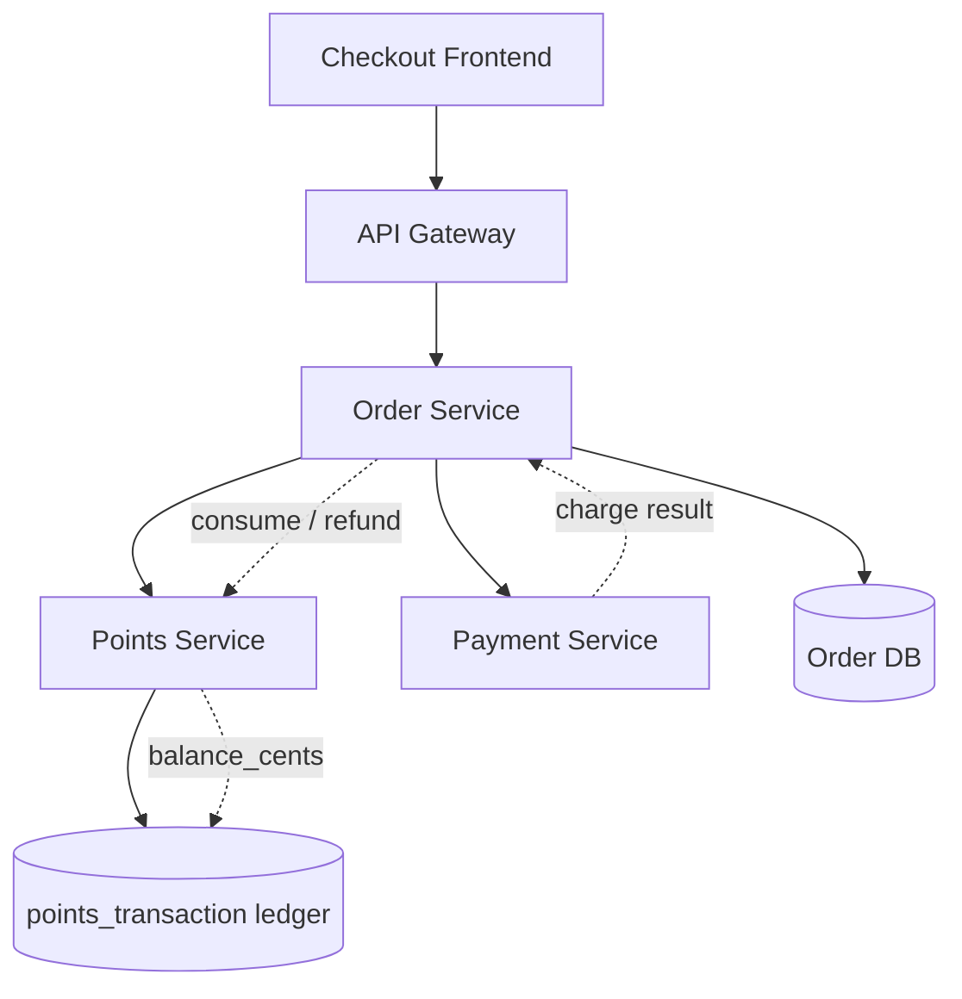
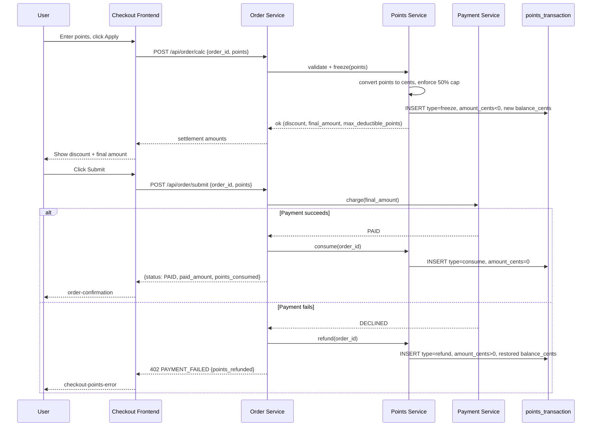

# Loyalty Points Checkout Discount Technical Spec

## TL;DR

Users redeem loyalty points for a checkout discount at a fixed rate of 100 points = $1.00, capped at 50% of the order subtotal. Points are frozen when the discount is calculated, consumed on successful order submission, and refunded on payment failure or refund. All money is stored as integer cents to avoid rounding drift. Estimated effort: ~5.5 engineer-days across backend and frontend.

## 1. Links

- **PRD**: PRD-001
- **Related ADRs**: ADR-014 (money stored as integer cents), ADR-021 (two-phase ledger for redeemable balances)
- **Related existing SPECs**: none

## 2. Technical Approach Overview

We add a points-redemption layer to the existing checkout flow without rewriting the order pipeline. A new `POST /api/order/calc` endpoint computes the discount and freezes the requested points against the user's balance; `POST /api/order/submit` consumes the frozen points on a successful charge. A single append-only `points_transaction` ledger records every freeze, consume, and refund movement, so the user's redeemable balance is always derivable from the latest `balance_cents` row. The Points Service owns the ledger and exposes freeze/consume/refund operations to the Order Service; the existing Payment Service drives the consume-vs-refund decision based on the charge result. The 100 points = $1.00 conversion and the 50% subtotal cap are enforced server-side in the Points Service so the frontend can never bypass them.

## 3. Architecture Diagram



## 4. Module / Component Breakdown

| Component | Responsibility | Type | Owner agent |
|---|---|---|---|
| OrderCalcAPI | `POST /api/order/calc`: validate points, compute discount, freeze | New | backend |
| OrderSubmitAPI | `POST /api/order/submit`: charge, then consume or refund points | New | backend |
| PointsLedgerService | Append freeze/consume/refund rows, derive balance | New | backend |
| DiscountCalculator | Pure conversion + 50% cap logic (cents arithmetic) | New | backend |
| CheckoutPointsInput | Points input + apply button (`checkout-input-points`, `checkout-btn-apply-points`) | New | frontend |
| CheckoutSummary | Render discount and final amount (`checkout-discount`) | Modify | frontend |
| CheckoutErrorBanner | Surface points errors (`checkout-points-error`) | New | frontend |
| CheckoutSubmit | Submit order (`checkout-btn-submit`) and route to confirmation (`order-confirmation`) | Modify | frontend |

## 5. API Design

### 5.1 POST /api/order/calc

**Purpose**: Calculate the order amount after applying points and freeze the points used.

**Request**:

```json
{
  "order_id": "ord_10231",
  "points": 100
}
```

**Response (success)**:

```json
{
  "code": "ok",
  "data": {
    "order_amount": 10000,
    "points_applied": 100,
    "discount": 100,
    "final_amount": 9900,
    "max_deductible_points": 5000
  }
}
```

All money fields (`order_amount`, `discount`, `final_amount`) are integer cents. `discount` of `100` represents $1.00 from 100 points. `max_deductible_points` is `5000` here because 50% of a $100.00 subtotal is $50.00, and $50.00 / ($1.00 per 100 points) = 5000 points.

**Response (error)**:

| Error Code | HTTP | Meaning | Trigger Condition |
|---|---|---|---|
| POINTS_INSUFFICIENT | 400 | Not enough points | Requested `points` > user's redeemable balance |
| POINTS_OVER_LIMIT | 400 | Exceeds 50% cap | Resulting discount > 50% of order subtotal |
| ORDER_NOT_FOUND | 404 | Order does not exist | Unknown or non-pending `order_id` |

**Error body example**:

```json
{
  "code": "POINTS_OVER_LIMIT",
  "message": "Discount cannot exceed 50% of the order subtotal",
  "data": {
    "max_deductible_points": 5000
  }
}
```

### 5.2 POST /api/order/submit

**Purpose**: Submit the order, charge the customer, then consume the frozen points on success or refund them on failure.

**Request**:

```json
{
  "order_id": "ord_10231",
  "points": 100
}
```

**Response (success)**:

```json
{
  "code": "ok",
  "data": {
    "order_id": "ord_10231",
    "status": "PAID",
    "paid_amount": 9900,
    "points_consumed": 100
  }
}
```

`paid_amount` is integer cents ($99.00). On success the previously frozen 100 points are converted to a `consume` ledger row.

**Response (error)**:

| Error Code | HTTP | Meaning | Trigger Condition |
|---|---|---|---|
| POINTS_INSUFFICIENT | 400 | Not enough points | Requested `points` > user's redeemable balance |
| POINTS_OVER_LIMIT | 400 | Exceeds 50% cap | Resulting discount > 50% of order subtotal |
| ORDER_NOT_FOUND | 404 | Order does not exist | Unknown or non-pending `order_id` |
| PAYMENT_FAILED | 402 | Charge declined | Payment Service rejects the charge; frozen points are refunded |

**Error body example (payment failure)**:

```json
{
  "code": "PAYMENT_FAILED",
  "message": "Payment was declined; frozen points have been refunded",
  "data": {
    "order_id": "ord_10231",
    "points_refunded": 100
  }
}
```

## 6. Data Model

### Table: points_account (existing)

No changes. Holds the user's lifetime earned/spent points; the redeemable balance for checkout is derived from the latest `points_transaction.balance_cents`.

### Table: points_transaction (new)

| Field | Type | Required | Constraints | Notes |
|---|---|---|---|---|
| id | bigint | yes | PK, auto_increment | |
| user_id | bigint | yes | FK -> points_account.user_id | Owner of the movement |
| order_id | varchar(50) | yes | indexed | Associated order |
| amount_cents | int | yes | | Signed change in cents (note: unit is cents, not dollars) |
| balance_cents | int | yes | | Redeemable balance in cents after this movement |
| type | enum | yes | freeze / consume / refund | Ledger movement kind |
| created_at | timestamp | yes | default NOW | |

Indexes:
- `idx_user_created` (user_id, created_at) — derive current balance, list user history
- `idx_order` (order_id) — locate all movements for an order during consume/refund

Notes:
- The ledger is append-only. A `freeze` row deducts from `balance_cents`; `consume` finalizes a prior freeze with no further balance change; `refund` adds the frozen amount back to `balance_cents`.
- `amount_cents` is converted from points at calc time using 100 points = 100 cents, so the points-to-cents factor is 1:1 and stays integer-exact.

## 7. Technical Implementation of the Business Flow

### 7.1 Freeze / Consume / Refund Flow (two-phase)



### 7.2 Exception Handling

- Freeze succeeds but the user abandons checkout -> frozen points auto-refund after 30 minutes via a cron sweep over `freeze` rows with no matching `consume`/`refund`.
- Charge succeeds but the `consume` write fails -> retried by an idempotent reconciliation job keyed on `order_id`; the ledger's `idx_order` guarantees a single consume per order.
- Duplicate submit for the same `order_id` is rejected by the order status check (only `PENDING` orders accept calc/submit), preventing double consume.

## 8. Implementation Task Breakdown

| TaskID | Description | Owner | Depends On | Estimate |
|---|---|---|---|---|
| T1 | DB migration: create points_transaction table + indexes | backend | - | 0.5 d |
| T2 | DiscountCalculator: 100 pts = $1.00 conversion + 50% cap (cents) | backend | - | 0.5 d |
| T3 | PointsLedgerService: freeze / consume / refund + balance derivation | backend | T1 | 1 d |
| T4 | Implement OrderCalcAPI (POST /api/order/calc) with error codes | backend | T2, T3 | 1 d |
| T5 | Implement OrderSubmitAPI (POST /api/order/submit) incl. PAYMENT_FAILED refund | backend | T3, T4 | 1 d |
| T6 | CheckoutPointsInput component (checkout-input-points, checkout-btn-apply-points) | frontend | - | 0.5 d |
| T7 | Modify CheckoutSummary + CheckoutErrorBanner (checkout-discount, checkout-points-error) | frontend | - | 0.5 d |
| T8 | Wire frontend to calc + submit, route to order-confirmation (checkout-btn-submit) | frontend | T4, T5, T6, T7 | 0.5 d |

Parallelization opportunities: backend runs T1 -> T2/T3 -> T4 -> T5; frontend builds T6 and T7 in parallel against mocks, with T8 as the integration phase once T4 and T5 are live.

## 9. Performance / Availability Targets

- OrderCalcAPI P95: < 200ms
- OrderSubmitAPI P95: < 500ms (includes synchronous charge)
- Availability: 99.9%
- Ledger consistency: strong (single-writer Points Service, row-level lock per user during freeze/consume/refund)

## 10. Risks and Mitigations

| Risk | Probability | Impact | Mitigation |
|---|---|---|---|
| Points/money precision drift | Medium | Finances don't reconcile | Store all money as integer cents; DiscountCalculator unit tests cover cap and rounding boundaries |
| Duplicate consume under concurrency | Medium | User over-charged in points | Per-user row lock + idempotency keyed on order_id; idx_order enforces one consume per order |
| Frozen points stranded on abandonment | Medium | User can't re-spend points | 30-minute cron auto-refund of dangling freeze rows |
| Refund not triggered on payment failure | Low | User loses points (violates AC4) | OrderSubmitAPI always issues refund on PAYMENT_FAILED before returning 402 |
